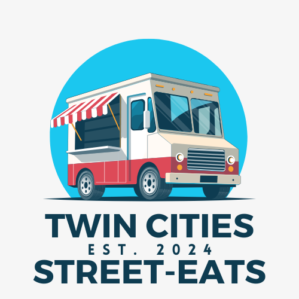

# Twin Cities StreetEats



## About

Twin Cities StreetEats is an innovative platform designed to enhance the food truck experience in the Minneapolis-St. Paul metro area. Our app connects food enthusiasts with local street food vendors through an interactive, real-time map interface, comprehensive search functionality, and community-driven reviews.

## Features

### For Users

- **Interactive Map**: Find food trucks in real-time with our Leaflet API integration
- **Advanced Search**: Filter trucks by location, cuisine type, price range, and dietary restrictions
- **Detailed Profiles**: View menus, photos, and operating hours for each food truck
- **Review System**: Rate and review your experiences to help other foodies
- **Bookmarks**: Save your favorite trucks for quick access
- **User Accounts**: Secure login via email or social accounts

### For Vendors

- **Truck Management**: Create and update your truck's profile, menu, and locations
- **Customer Feedback**: View and respond to customer reviews
- **Business Insights**: Track customer engagement (upcoming feature)

## Technology Stack

- **Frontend**: React, Redux, Material-UI/Tailwind CSS
- **Backend**: Node.js, Express.js
- **Database**: PostgreSQL
- **APIs**:
    - Leaflet (Interactive Maps)
    - ChatGPT API (Personalized Recommendations, Optional)
- **Deployment**: Heroku/AWS

## Installation

```bash
# Clone the repository
git clone https://github.com/yourusername/twin-cities-streetEats.git

# Navigate to project directory
cd twin-cities-streetEats

# Install dependencies
npm install

# Set up environment variables
cp .env.example .env
# Edit .env with your API keys and database credentials

# Run development server
npm run dev

```

## Usage

### User Flow

1. Register or log in to your account
2. Use the map or search function to find food trucks
3. Filter results by cuisine, price, or dietary restrictions
4. View truck details, menus, and reviews
5. Leave your own reviews and bookmark favorite trucks

### Vendor Flow

1. Register as a food truck vendor
2. Create your truck profile with menu, photos, and locations
3. View and respond to customer reviews
4. Update your locations and menu offerings

## Project Status

This project is currently in development by Bruce Ray McCampbell as part of the Redwood Cohort (October 2024).

## Browser Support

- Safari Mobile (Version 18.0+)
- Chrome Mobile (Version 130.0+)

## Contact

Bruce Ray McCampbell - mccampbellbruce@gmail.com

Project Link: https://github.com/Bmccampbell12